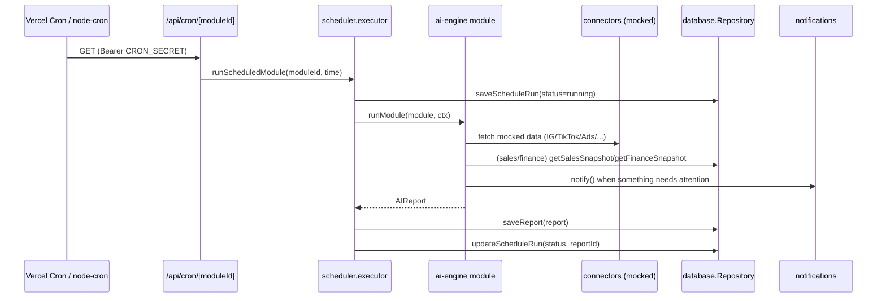
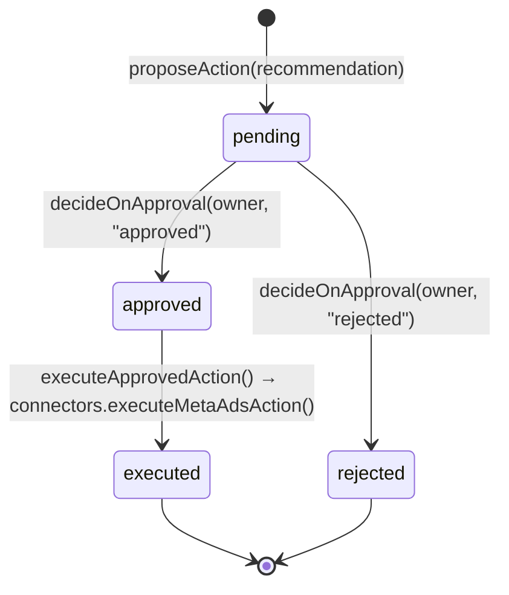

# Architecture

## Overview

mkh-ai-os is a pnpm/Turborepo monorepo: one Next.js app (`apps/dashboard`)
and eight independent packages implementing Clean Architecture layers. Every
package depends only on `@mkh/shared` and the layers below it — never
sideways into the dashboard — so `ai-engine`, `scheduler`, and
`notifications` can be lifted into a standalone worker process later without
touching application code.

```
apps/dashboard  ──┐
                   ├─▶ @mkh/ai-engine ──▶ @mkh/connectors
packages/scheduler ┘        │        └─▶ @mkh/notifications ──▶ @mkh/database
                             ├─▶ @mkh/security
                             └─▶ @mkh/database ──▶ @mkh/shared
packages/mcp-server ────────────────────────────────────────────┘
```

Why a monorepo instead of one Next.js folder: the brief requires the AI
modules to work as **background workers**, not request-scoped chatbot
logic. Keeping `ai-engine`/`scheduler`/`notifications`/`connectors` as
separate packages means:

1. They have zero dependency on Next.js and can run standalone (`pnpm
   scheduler:dev`, `pnpm mcp:dev`) or inside API routes.
2. Vercel serverless functions have execution-time limits; if a module ever
   needs a long-running job, only the entry point changes (e.g. a dedicated
   worker service), not the module logic.
3. Clear boundaries mirror the brief's explicit ask: "Pisahkan: AI Engine /
   Scheduler / Notification / Connectors / Dashboard / Logs / Config /
   Security."

## Layers

| Package | Responsibility |
|---|---|
| `@mkh/shared` | Cross-cutting types (`AIReport`, `NotificationMessage`, ...), env config loader, structured logger, id generator |
| `@mkh/database` | `Repository` interface + `InMemoryRepository` (default) + `SupabaseRepository`; the only layer allowed to know about persistence |
| `@mkh/security` | RBAC roles, the Meta Ads approval-gate state machine, audit-log entry builder |
| `@mkh/connectors` | Mocked external integrations (Instagram, TikTok, Meta Ads, MK Connect guardrail) — the only layer allowed to "know" about third-party APIs |
| `@mkh/notifications` | `NotificationChannel` interface, dummy channel (default) + WhatsApp/Telegram/Email/Push adapter skeletons |
| `@mkh/ai-engine` | `AIModule` interface, `AgentRunner`, the five AI modules, and the module registry |
| `@mkh/scheduler` | Time-slot → module registry, local `node-cron` runner, shared executor used by Vercel Cron routes |
| `@mkh/mcp-server` | Read-only MCP server exposing system state to Claude/MCP clients |
| `apps/dashboard` | Next.js UI (Server Components read the repository directly) + `/api/cron/[moduleId]` |

## Data flow (one module's daily run)



## Meta Ads Stage 2 (approval-gated actions)



`assertApproved()` in `@mkh/security` is the single gate every execution
path must pass — it throws `ApprovalError` for anything not in `approved`
status. Every outcome (executed or failed) is written to `action_logs`.

## Data modes

`DATA_MODE=dummy` (default): `InMemoryRepository` seeded from
`packages/database/src/seed-data.ts`. Nothing persists across restarts, no
external calls — safe to run anywhere, including CI.

`DATA_MODE=supabase`: `SupabaseRepository` against the schema in
`supabase/migrations/`. Sales/finance "source of truth" reads still return
the same seed fixtures until a real ERP sync exists (see `ROADMAP.md`).

Both implementations satisfy the same `Repository` interface
(`packages/database/src/repository.ts`), so no module, page, or MCP tool
needs to know which mode is active.

## Security boundaries

- Sales Supervisor and Finance Analyst never call a `save*` method for
  business data — only `get*Snapshot()` — enforced by omitting write
  methods from `Repository` for those tables entirely.
- Meta Ads actions can only reach `connectors.executeMetaAdsAction()`
  through `workflow.executeApprovedAction()`, which calls
  `assertApproved()` first.
- `connectors.callMkConnect()` always throws — a guardrail against
  accidental production wiring before the Owner authorizes it.
- RBAC (`@mkh/security/roles.ts`) currently gates one action
  (`meta-ads:approve-action` → `owner` only); extend the table as more
  gated actions are added.
