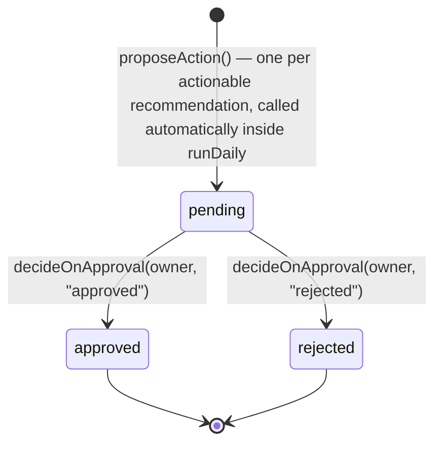
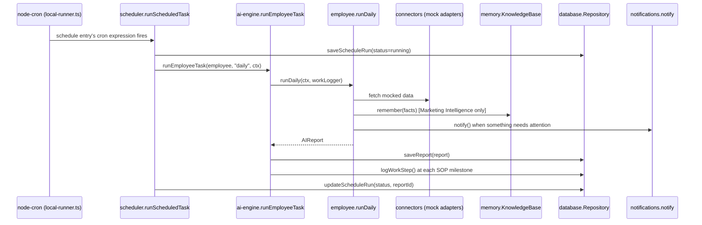

# Architecture — AI Workforce Engine

## Overview

mkh-ai-os is a **backend service**, not an application with its own UI.
Every AI is modeled as a digital employee: an id, a role, a declared SOP
(daily/weekly/monthly), persistent memory where relevant, and a granular
work log. `apps/dashboard` exists only as a frozen, read-only internal
debug viewer built during an earlier phase — it is not part of the active
roadmap. All future UI lives in **MK Connect**; this repo's job is to be
ready for MK Connect to call into, once the Owner authorizes integration.

```
packages/scheduler ──▶ packages/ai-engine (6 AIEmployee implementations)
                              │
                              ├─▶ packages/memory ──▶ packages/database
                              ├─▶ packages/security
                              ├─▶ packages/notifications ──▶ packages/database
                              ├─▶ packages/connectors (ports + mock adapters)
                              └─▶ packages/database ──▶ packages/shared

packages/mcp-server ──▶ packages/database, packages/ai-engine (read-only)
```

## Why every package depends only downward

`ai-engine`, `scheduler`, `memory`, and `notifications` have zero
dependency on any HTTP framework — they're plain TypeScript that runs the
same way whether invoked by `pnpm scheduler:dev` (a bare Node process),
a future MK Connect webhook, or a test file. This is what "backend
service, not an app" means in practice: nothing in the employee logic
knows or cares how it was triggered.

## The employee model

Every employee implements `AIEmployee<TData>`
(`packages/ai-engine/src/core/ai-employee.ts`):

```ts
interface AIEmployee<TData> {
  id: AIModuleId;
  name: string;          // "Marketing Intelligence AI"
  role: string;           // "Kepala Riset Marketing" — the job title
  description: string;
  sop: EmployeeSOP;        // declared daily/weekly/monthly steps, see docs/SOP.md
  runDaily(context, log): Promise<AIReport<TData>>;   // mandatory
  runWeekly?(context, log): Promise<AIReport<TData>>;  // optional
  runMonthly?(context, log): Promise<AIReport<TData>>; // optional
}
```

`runEmployeeTask(employee, cadence, context)`
(`packages/ai-engine/src/core/agent-runner.ts`) is the one entry point that
runs a task, persists the resulting `AIReport`, and — critically — always
returns a report even if the task method throws, so callers never handle a
rejected promise. Every employee also declares all three cadences today
(see each module's `module.ts`); weekly/monthly implementations share
`aggregateRecentReports(moduleId, days)` to summarize a real window of
daily reports rather than re-deriving from scratch, so they stay genuine
without needing 18 fully bespoke aggregation routines.

## Work log — the SOP step trail

Every task method receives a `WorkLogger`
(`packages/ai-engine/src/core/work-logger.ts`) and calls
`log.step("Research Completed", detail)` at each SOP milestone. Each call
does two things: writes a structured console log line, and persists a
`WorkLogEntry` row (`packages/database`) tied to the run via `runId`. This
is what makes "08:00 Started / 08:12 Research Completed / 08:15 Saved
Memory / 08:20 Finished" a real, queryable trail instead of a narrative —
query it via the MCP server's `list_work_log` tool or
`Repository.listWorkLog()` directly.

## Memory / knowledge base

Marketing Intelligence is the one employee with persistent, cumulative
memory. The split mirrors how `@mkh/security` already layers business
rules over `@mkh/database`'s plain persistence:

- `@mkh/database` — dumb storage: `upsertKnowledgeItem`, `listKnowledgeItems`.
- `@mkh/memory` — the behavior: `mergeKnowledgeItem` (bump `timesSeen`/
  `lastSeenAt` on rediscovery instead of duplicating) and the
  `KnowledgeBase` class (`remember()`, `recall()`, `stats()`).

Concretely: day 1's research finds 50 signals → 50 new `KnowledgeItem`
rows. Day 2 rediscovers 30 of those plus 20 new ones → the 30 get
`timesSeen: 2`, `lastSeenAt` refreshed; only the 20 genuinely new ones
insert. Verified end-to-end in
`packages/memory/src/merge.test.ts` and by direct smoke test (see commit
history) — a second same-day run of Marketing Intelligence found 0 new
signals and 16 recurring, confirming no duplication.

## Connectors — ports and mock adapters

`packages/connectors` is deliberately structured as ports-and-adapters:

```
ports/               interfaces (SocialResearchConnector, TrendConnector,
                      MetaAdsConnector, ExternalSystemConnector)
adapters/mock/        today's only implementations — realistic fake data,
                      zero network calls
registry.ts           getSocialResearchConnector() etc. — the one place
                      that decides which adapter backs each port
```

Every employee calls the `registry.ts` factory functions, never an adapter
directly. Swapping in a real integration later (Instagram Graph API, Meta
Marketing API, ...) is "write `adapters/instagram-graph-api.adapter.ts`
implementing `SocialResearchConnector`, change one return statement in
`registry.ts`" — zero changes to any employee's logic. `getExternalSystemConnector()`
(MK Connect) only has a guardrail adapter that always throws, until the
Owner authorizes integration.

## Meta Ads AI's workflow (propose + decide, no execution)



This is the workflow's *entire* scope today. There is no `execute()` on
`MetaAdsConnector` and no code path that would call the real Meta
Marketing API — publishing/mutating a campaign is a distinct future phase
requiring its own explicit sign-off (see `docs/ROADMAP.md`). `decideOnApproval`
enforces RBAC via `@mkh/security` (only the `owner` role may decide);
today nothing calls it automatically — it's ready for MK Connect (or a
human via MK Connect's UI) to call once that integration exists.

## Data flow, one daily task



## Data modes

`DATA_MODE=dummy` (default): `InMemoryRepository`, seeded from
`packages/database/src/seed-data.ts`. No external calls, safe anywhere.

`DATA_MODE=supabase`: `SupabaseRepository` against
`supabase/migrations/`. Sales/finance/Markom-completion reads still return
seed fixtures until a real ERP sync exists.

Both satisfy the same `Repository` interface — no employee, the scheduler,
or the MCP server needs to know which mode is active.

## Security boundaries

- Sales Supervisor and Finance Analyst only ever call `get*Snapshot()` —
  `Repository` has no write methods for those tables, so there's no code
  path that could mutate business data even by mistake.
- Meta Ads AI can only reach `proposeAction()`/`decideOnApproval()` — no
  execute path exists in this phase (see above).
- `getExternalSystemConnector().call()` (MK Connect) always throws — a
  guardrail against accidental production wiring.
- RBAC (`@mkh/security/roles.ts`) gates `meta-ads:approve-action` to the
  `owner` role only; extend the table as more gated actions are added.
