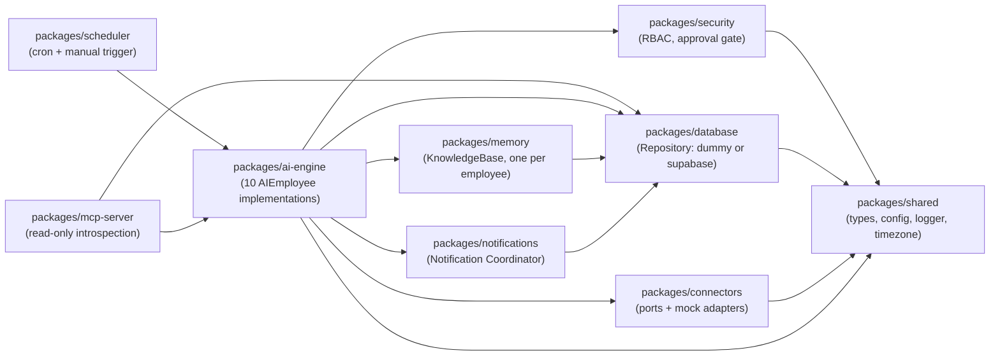
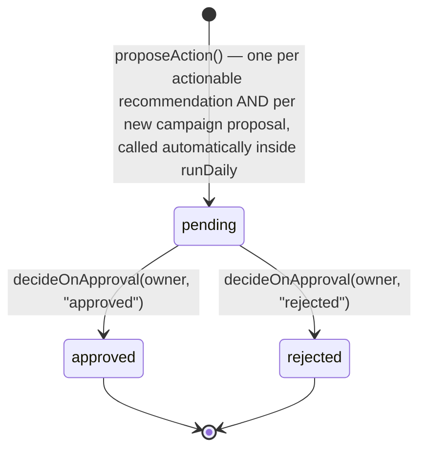
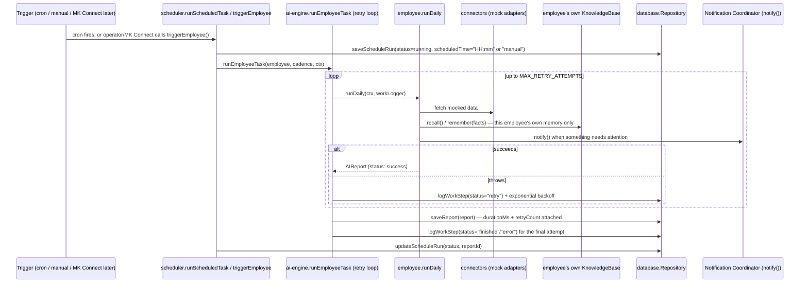
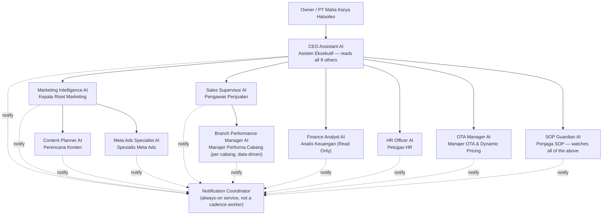

# Architecture — Digital Management Team (AI Workforce Engine)

## Overview

mkh-ai-os is a **backend service**, not an application with its own UI.
Every AI is modeled as a digital employee: an id, a role, a declared SOP
(daily/weekly/monthly), its **own** persistent memory (no shared memory
between employees), and a granular, retry-aware work log. `apps/dashboard`
exists only as a frozen, read-only internal debug viewer built during an
earlier phase — it is not part of the active roadmap. All future UI lives
in **MK Connect**; this repo's job is to be ready for MK Connect to call
into (via `triggerEmployee()` — see "Manual trigger" below), once the
Owner authorizes integration.

Ten employees are implemented today, all built to the same standard (SOP,
workflow, scheduler, memory, knowledge base, notification hook, logging,
retry strategy, error handling) even though none of them call a real
external AI/LLM API yet — see `docs/ROADMAP.md` for what "Sprint 2" adds
on top of this foundation.

## Package dependency graph



## Why every package depends only downward

`ai-engine`, `scheduler`, `memory`, and `notifications` have zero
dependency on any HTTP framework — they're plain TypeScript that runs the
same way whether invoked by `pnpm scheduler:dev` (a bare Node process),
the manual-trigger CLI/service, a future MK Connect webhook, or a test
file. This is what "backend service, not an app" means in practice:
nothing in the employee logic knows or cares how it was triggered.

## The employee model

Every employee implements `AIEmployee<TData>`
(`packages/ai-engine/src/core/ai-employee.ts`):

```ts
interface AIEmployee<TData> {
  id: AIModuleId;
  name: string;          // "Marketing Intelligence AI"
  role: string;           // "Kepala Riset Marketing" — the job title
  description: string;
  sop: EmployeeSOP;        // declared daily/weekly/monthly steps, see docs/SOP.md
  runDaily(context, log): Promise<AIReport<TData>>;   // mandatory
  runWeekly?(context, log): Promise<AIReport<TData>>;  // optional
  runMonthly?(context, log): Promise<AIReport<TData>>; // optional
}
```

`runEmployeeTask(employee, cadence, context)`
(`packages/ai-engine/src/core/agent-runner.ts`) is the one entry point that
runs a task, persists the resulting `AIReport`, and — critically — always
returns a report even if the task method throws, so callers never handle a
rejected promise. Every employee also declares all three cadences today
(see each module's `module.ts`); weekly/monthly implementations share
`aggregateRecentReports(moduleId, days)` to summarize a real window of
daily reports rather than re-deriving from scratch, so they stay genuine
without needing 30 fully bespoke aggregation routines.

## Retry strategy — no employee "just fails"

`runEmployeeTask` wraps every attempt in a bounded retry loop: up to
`MAX_RETRY_ATTEMPTS` tries (default 3, configurable via
`packages/shared/src/config.ts`, zod-validated, no hardcoding), exponential
backoff (`RETRY_BACKOFF_MS * 2^attempt`) between attempts. A transient
failure inside `runDaily`/`runWeekly`/`runMonthly` never propagates as a
rejected promise to the scheduler, the manual-trigger service, or CEO
Assistant reading a sibling — only after every retry is exhausted does the
runner return a `status: "error"` `AIReport`, and even then it *returns*
rather than throws. Every attempt is recorded in the work log (a
`status: "retry"` entry per failed attempt); the final report always
carries `durationMs` and `retryCount` (0 = succeeded on the first try).

## Work log — the SOP step trail

Every task method receives a `WorkLogger`
(`packages/ai-engine/src/core/work-logger.ts`) and calls
`log.step("step_id", detail)` at each SOP milestone. Each call writes a
structured console log line and persists a `WorkLogEntry` row
(`packages/database`) tied to the run via `runId` and tagged with which
retry `attempt` it belongs to. This is what makes "08:00 Started / 08:12
Research Completed / 08:15 Saved Memory / 08:20 Finished" (or, on a bad
day, "... / 08:15 Retry 1 / 08:16 Finished") a real, queryable trail
instead of a narrative — query it via the MCP server's `list_work_log`
tool, `Repository.listWorkLog()` directly, or as the evidence SOP Guardian
reads when checking whether a run's step trail is structurally complete.

## Memory / knowledge base — one per employee, never shared

Every employee has its **own** memory; no employee reads or writes another
employee's knowledge base. The split mirrors how `@mkh/security` already
layers business rules over `@mkh/database`'s plain persistence:

- `@mkh/database` — dumb storage: `upsertKnowledgeItem`, `listKnowledgeItems`.
- `@mkh/memory` — the behavior: `mergeKnowledgeItem` (bump `timesSeen`/
  `lastSeenAt` on rediscovery instead of duplicating) and the
  `KnowledgeBase` class (`remember()`, `recall()`, `stats()`), always
  constructed as `new KnowledgeBase(getRepository())` and always read
  through the abstraction — never a raw `Repository.listKnowledgeItems()`
  call from employee code.

Every knowledge item's `id` is namespaced `${moduleId}:${category}:...`,
so even though all employees share the same underlying `knowledge_items`
table, each employee's `KnowledgeBase.recall(moduleId, category)` call is
scoped to its own `moduleId` and never sees another employee's rows:

| Employee | Category | What it remembers |
|---|---|---|
| Marketing Intelligence | (several) | Viral content, competitor activity, trend signals |
| Content Planner | `content-theme-used` | Themes already used, to avoid repeats |
| Meta Ads Specialist | `campaign-proposal` | New campaigns already proposed |
| Sales Supervisor | `rep-follow-up-history` | Reps that needed a recovery/scaling strategy |
| Branch Performance Manager | `branch-recommendation-history` | Recommendations sent per branch |
| Finance Analyst | `anomaly-history` | Flagged transactions |
| HR Officer | `staff-flag-history` | Staff flagged for attendance/KPI issues |
| OTA Manager | `pricing-history` | Dynamic pricing recommendations per property |
| SOP Guardian | `violation-history` | SOP violations detected per employee |
| CEO Assistant | `attention-theme-history` | Recurring attention themes across all siblings |

Concretely: day 1's research finds 50 signals → 50 new `KnowledgeItem`
rows. Day 2 rediscovers 30 of those plus 20 new ones → the 30 get
`timesSeen: 2`, `lastSeenAt` refreshed; only the 20 genuinely new ones
insert. Verified in `packages/memory/src/merge.test.ts` and by every
employee's own test suite.

## Connectors — ports and mock adapters

`packages/connectors` is deliberately structured as ports-and-adapters:

```
ports/               interfaces (SocialResearchConnector, TrendConnector,
                      MetaAdsConnector, OTAConnector, ExternalSystemConnector)
adapters/mock/        today's only implementations — realistic fake data,
                      zero network calls
registry.ts           getSocialResearchConnector() etc. — the one place
                      that decides which adapter backs each port
```

Every employee calls the `registry.ts` factory functions, never an adapter
directly. Swapping in a real integration later (Instagram Graph API, Meta
Marketing API, a real OTA channel manager API, ...) is "write
`adapters/instagram-graph-api.adapter.ts` implementing
`SocialResearchConnector`, change one return statement in `registry.ts`" —
zero changes to any employee's logic. `getExternalSystemConnector()`
(MK Connect) only has a guardrail adapter that always throws, until the
Owner authorizes integration.

## Meta Ads Specialist's workflow (propose + decide, no execution)



This is the workflow's *entire* scope today. Every proposal — a budget
adjustment to an existing campaign or a brand-new campaign draft (with
objective, audience, budget, creative recommendation, and suggested
publish time) — goes through the identical lifecycle, and `pending` IS
"WAITING OWNER APPROVAL". There is no `execute()` on `MetaAdsConnector`
and no code path that would call the real Meta Marketing API — publishing/
mutating a campaign is a distinct future phase requiring its own explicit
sign-off (see `docs/ROADMAP.md`). `decideOnApproval` enforces RBAC via
`@mkh/security` (only the `owner` role may decide); today nothing calls it
automatically — it's ready for MK Connect (or a human via MK Connect's UI)
to call once that integration exists.

## Workflow diagram — one daily task, start to finish



## Digital Management Team — org chart



The Notification Coordinator (`packages/notifications`) is deliberately
**not** one of the ten `AIEmployee`s in `AI_MODULE_IDS` — it's an always-on
dispatch service every employee calls through (`notify()`), not a
cadence-based worker with its own daily/weekly/monthly SOP. Every dashed
arrow above is the same one function call; no employee ever reaches a
`NotificationChannel` directly.

## Manual trigger — no UI, a callable service

`packages/scheduler/src/manual-trigger.ts` exports `triggerEmployee({
moduleId, cadence, requestedBy })` — the exact codepath a scheduled cron
run takes (`saveScheduleRun` → `runEmployeeTask` → `updateScheduleRun`),
just tagged `scheduledTime: "manual"` and `triggeredBy: "manual"` so it's
distinguishable in history. A CLI wrapper
(`pnpm employee:trigger -- --module=<id> --cadence=<daily|weekly|monthly>
--by=<who>`, `packages/scheduler/src/trigger-cli.ts`) exists for operator
use today; `triggerEmployee()` itself is the function MK Connect will call
directly once that integration is authorized — no UI, no HTTP layer
required for that call to work.

## Data flow, one daily task (implementation detail view)

See "Workflow diagram" above for the trigger-to-completion sequence. In
short: every employee's `runDaily`/`runWeekly`/`runMonthly` only ever
talks to `packages/connectors` (mocked), its own `KnowledgeBase`, and
`packages/database`'s `Repository` — never a raw network call, never
another employee's memory.

## Data modes

`DATA_MODE=dummy` (default): `InMemoryRepository`, seeded from
`packages/database/src/seed-data.ts`. No external calls, safe anywhere.

`DATA_MODE=supabase`: `SupabaseRepository` against
`supabase/migrations/`. Sales/finance/HR/Markom-completion reads still
return seed fixtures until a real ERP sync exists.

Both satisfy the same `Repository` interface — no employee, the scheduler,
the manual-trigger service, or the MCP server needs to know which mode is
active.

## Configuration — zero hardcoding

Every tunable value (retry attempts/backoff, notification default
channel, data mode, timezone-sensitive behavior) is read through
`packages/shared/src/config.ts`'s zod-validated `getConfig()` — never
inlined as a magic number in employee code. See `.env.example` for the
full list.

## Security boundaries

- Sales Supervisor, Branch Performance Manager, Finance Analyst, and HR
  Officer only ever call `get*Snapshot()`/`getHRSnapshot()` — `Repository`
  has no write methods for those tables, so there's no code path that
  could mutate business data even by mistake.
- Meta Ads Specialist can only reach `proposeAction()`/`decideOnApproval()`
  — no execute path exists in this phase (see above).
- `getExternalSystemConnector().call()` (MK Connect) always throws — a
  guardrail against accidental production wiring.
- SOP Guardian is read-only: it observes reports and work log entries and
  raises warnings, but has no write path into any other employee's data.
- RBAC (`@mkh/security/roles.ts`) gates `meta-ads:approve-action` to the
  `owner` role only; extend the table as more gated actions are added.
