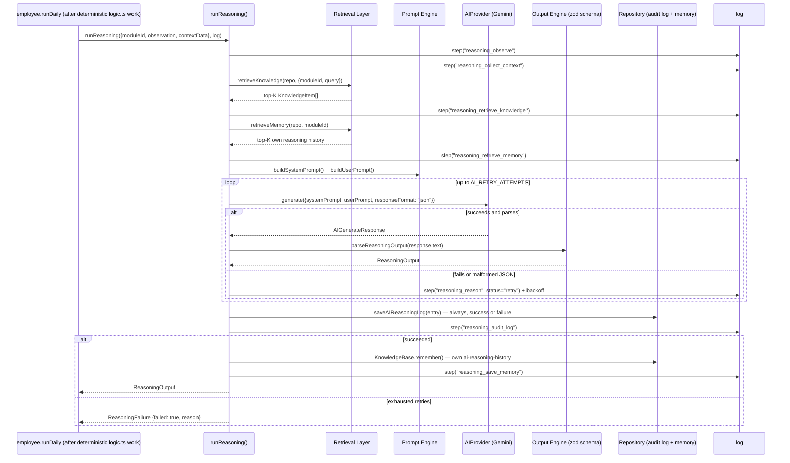

# Reasoning Flow — the fixed pipeline every employee's "thinking" runs through

`runReasoning(input, log, providerOverride?)`
(`packages/ai-engine/src/reasoning/reasoning-engine.ts`) is the *one*
function every Digital Employee's reasoning call goes through, in this
exact, fixed order — no employee has its own variant:

```
Observe → Collect Context → Retrieve Knowledge → Retrieve Memory
  → Reason (bounded retry) → Decision/Recommendation/Confidence/NeedApproval
  → Audit Log → Save Memory
```



## Step-by-step

1. **Observe** — the employee's own deterministic `AIReport.summary`
   (already computed by `logic.ts` before reasoning ever runs) becomes the
   `observation`.
2. **Collect Context** — a small, hand-picked `contextData` object (never
   the whole `AIReport.data`).
3. **Retrieve Knowledge** — top-K relevant facts, see
   `docs/KNOWLEDGE_RETRIEVAL.md`.
4. **Retrieve Memory** — this employee's own recent reasoning history, see
   `docs/MEMORY_FLOW.md`.
5. **Reason** — `getAIProvider().generate()` with the assembled prompt
   (see `docs/PROMPT_ENGINE.md`), bounded retry (`AI_RETRY_ATTEMPTS`,
   exponential backoff `AI_RETRY_BACKOFF_MS * 2^attempt` — mirrors Sprint
   1's `runEmployeeTask` retry strategy exactly).
6. **Decision / Recommendation / Confidence / Need Approval** — the parsed,
   zod-validated `ReasoningOutput` (see "Output Engine" below).
7. **Audit Log** — an `AIReasoningLogEntry` is written **every time**,
   success or failure, capturing provider, model, response time, token
   usage, retry count, and (on failure) the error reason.
8. **Save Memory** — only on success (see `docs/MEMORY_FLOW.md`'s failure
   path note).

## Output Engine — structured, validated output

`packages/ai-engine/src/reasoning/output-schema.ts` defines
`reasoningOutputSchema` (zod), matching the brief's required minimum
fields exactly:

```ts
interface ReasoningOutput {
  priority: "low" | "medium" | "high" | "urgent";
  summary: string;
  recommendation: string;
  reason: string;
  confidenceScore: number;      // 0..1
  needApproval: boolean;
  escalation: string | null;
  nextAction: string;
}
```

`parseReasoningOutput(rawText)` strips a markdown code fence if present,
`JSON.parse`s, validates against the schema, and **never throws** — it
returns `{ success: false, error }` on any failure (non-JSON text, missing
field, out-of-range score, invalid priority), which `runReasoning()`
treats as a retryable failure rather than crashing the run.

## Error handling — exactly as specified

> Jika Gemini gagal: Retry. Jika Retry gagal: Audit Log. Jika tetap gagal:
> Structured Error.

- A transient provider error (network, 5xx, malformed JSON) → retried up
  to `AI_RETRY_ATTEMPTS` times with exponential backoff.
- A non-retryable provider error (e.g. missing API key) → skips straight
  to the audit log, no wasted retries.
- Retries exhausted → an `AIReasoningLogEntry` with `status: "error"` is
  persisted, and `runReasoning()` returns `{ failed: true, reason }` — it
  **never throws** to its caller, extending Sprint 1's "no employee just
  fails" guarantee one layer deeper: a Gemini outage degrades an
  employee's run to "no AI recommendation this time," never a crashed run.

## Correlating the audit log with the outer run

`WorkLogger` (`packages/ai-engine/src/core/work-logger.ts`) exposes
`readonly runId: string` — the same `runId` every `WorkLogEntry` for that
run carries. `runReasoning()` reads `log.runId` internally, so its
`AIReasoningLogEntry.runId` always matches the outer employee run's work
log entries without any caller needing to pass a redundant parameter.

## Testing

`reasoning-engine.test.ts` (9 tests, fake `AIProvider`s — no live network
calls in the automated suite) verifies: the full step sequence runs in
order on success, the audit log is persisted with correct
provider/model/tokens/retryCount, output is saved to memory, knowledge/
memory scoping never leaks across employees, a flaky provider is retried
and eventually succeeds, and three distinct failure shapes (`Error`
thrown, exhausted retries, malformed JSON) all resolve to a structured
`ReasoningFailure` rather than a throw.

See `docs/audits/SPRINT2_DOCUMENTATION.md` for the results of testing this
flow against the **live** Gemini API (not fakes).
